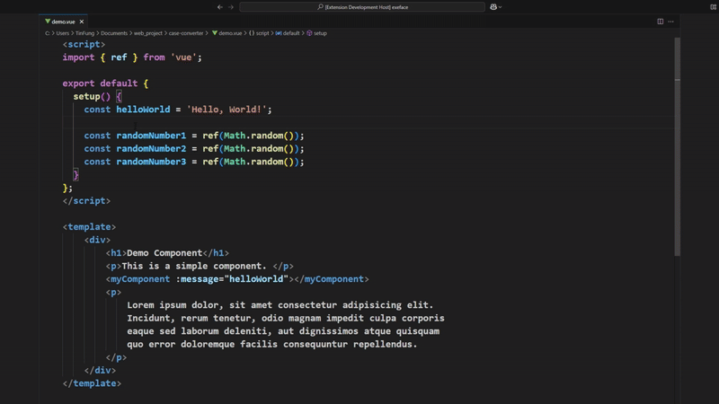
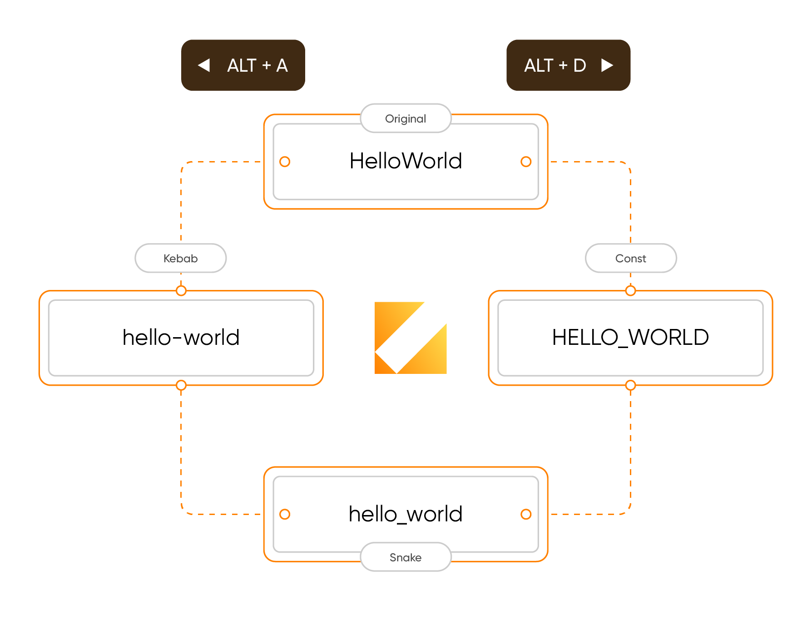

  

---

<h1 align="center">
Case Converter
</h1>

Quick case conversion with multiple case styles by keyboard shortcuts

 

  

 

  

## ✨ Features

- ⚡ Support for multiple selections
- 📦 Batch processing for large text blocks
- 💾 Remember original text for easy reversion
- 📌 Right-click context menu for direct case conversion

## 🚀 Usage

### Keyboard Shortcuts

- Press `Alt` + `D` to cycle forward
- Press `Alt` + `A` to cycle backward

### Multiple Selections

Case Converter works with multiple selections! Select different parts of your text and convert all selections simultaneously.

## ⚙️ Configuration

| Setting | Description | Default |
|---------|-------------|---------|
| `caseConverter.caseCycle` | Configure the order of cases to cycle through | `["original", "const", "camel", "snake", "kebab"]` |
| `caseConverter.showPopup` | Show notification popup when case conversion is performed | `false` |

## 🔠 Shortcut Key Conversion

Press `Alt` + `D` to cycle forward or `Alt` + `A` to cycle backward through case styles.

| Case Style | Example |
|------------|---------|
| Original | `helloWorld` |
| Constant | `HELLO_WORLD` |
| Pascal | `HelloWorld` |
| Camel | `helloWorld` |
| Snake | `hello_world` |
| Kebab | `hello-world` |

You can customize the order of this cycle in the extension settings.

## 📋 Examples

Convert between various case styles with a single keyboard shortcut:

- `hello world` → `HELLO_WORLD` → `helloWorld` → `hello_world` → `hello-world` → (Back to `hello world`)

## Feedback & Contributions

We welcome your feedback and contributions! Please report any issues or suggestions through:
- The "Report an Issue" command in VS Code
- Our [GitHub repository](https://github.com/fuzionix/vscode-case-converter/issues)

## License

This extension is licensed under the [MIT License](LICENSE).